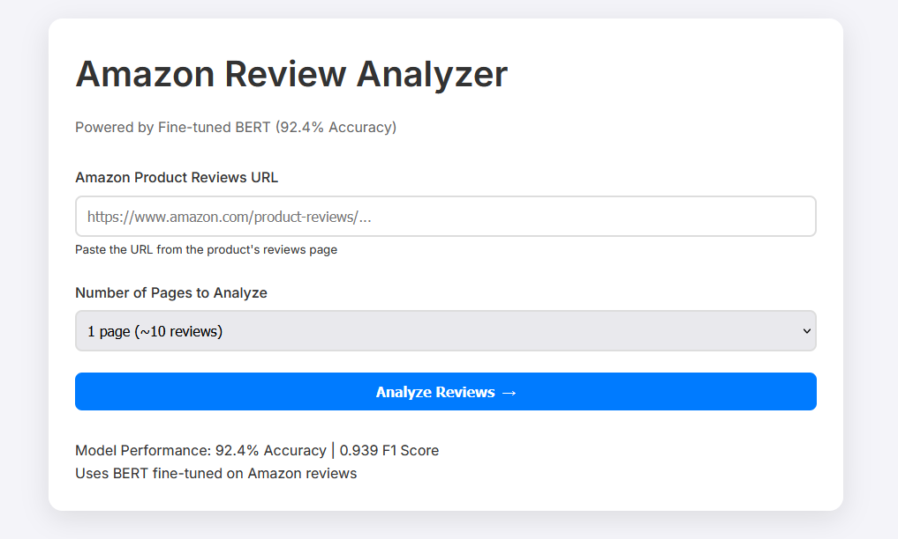
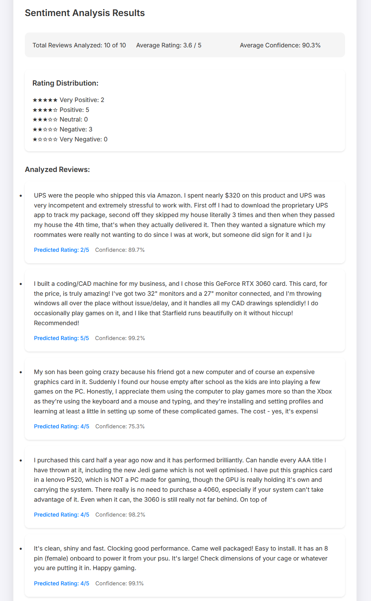

# Amazon Review Sentiment Analyzer

## **Overview**
A deep learning-powered web application that performs sentiment analysis on Amazon product reviews using a fine-tuned BERT model. The system scrapes reviews from Amazon product pages and provides detailed sentiment analysis with confidence scores and rating predictions.

---

## **Key Features**
- Custom fine-tuned BERT model (92.4% validation accuracy)
- Real-time Amazon review scraping
- Sentiment analysis with confidence scoring
- Interactive web interface
- Batch review processing
- Detailed sentiment breakdown and statistics

---

## **Technical Details**

### **Model Architecture**
- Base: BERT (bert-base-multilingual-uncased-sentiment)
- Fine-tuned on Amazon product reviews from Amazon Polarity Dataset
- Output: 5-class sentiment classification (1-5 stars)
- Training Duration: ~30 minutes on RTX 3070 Ti

### **Performance Metrics**
- Validation Accuracy: 92.4%
- F1 Macro Score: 0.939
- Validation Loss: 0.229
- Training Loss: 0.286
- Training Samples/Second: 16.154

### **Tech Stack**
- **Frontend**:
  - HTML5, CSS3
  - JavaScript

- **Backend**:
  - Python, Flask 
  - PyTorch

- **Model/ML**:
    - Transformers, BERT

- **Web Scraping**:
    - Selenium, BeautifulSoup4

- **Development**:
    - Git, VS Code


## **Installation**

### **Prerequisites**
- Python 3.8+
- CUDA-compatible GPU (recommended)
- Chrome WebDriver for Selenium

### **1. Clone the Repository**
```bash
git clone https://github.com/ShafeiW/PartReviewAnalyzer.git
```

### **2. Create a Virtual Environment**
```bash
python -m venv venv
.\venv\Scripts\activate
```

### **3. Install Dependencies**
Manually install the required Python packages:
```bash
pip install -r requirements.txt
```

### **4. Set Up Environment Variables**
Create a .env file in the project root directory and add your amazon credentials:
```bash
AMAZON_EMAIL='your_email@example.com'
AMAZON_PASSWORD='your_password'
```

### **5. Run the Application**
```bash
python app.py 
```

### **6. Navigate to local host: http://127.0.0.1:5000**

## **Usage**
1. Navigate to `http://localhost:5000` in your browser
2. Enter an Amazon product reviews URL
3. Select the number of pages to analyze (1-5)
4. View detailed sentiment analysis results including:
   - Overall sentiment distribution
   - Confidence scores
   - Individual review analysis
   - Statistical breakdown

## **Project Structure**
```bash
PartReviewAnalyzer/
├── app.py                 # Flask application
├── sentiment_model.py     # Fine-tuned BERT model
├── scrape.py             # Amazon scraping logic
├── static/               # Frontend assets
│   ├── styles.css        # Styling
│   └── script.js         # Frontend logic
└── templates/            # HTML templates
    └── index.html        # Main page
├── data/
│   ├── amazon_reviews_train.csv  # Training data
│   └── amazon_reviews_test.csv   # Testing data
├── .env                         # Environment variables
├── requirements.txt             # Dependencies
├── README.md                    # This file
├── .gitignore                   # Ignore files in git
```

## **Model Training Details**
- **Dataset**: Amazon Polarity Dataset
- **Training Process**:
  - Fine-tuned BERT model
  - AdamW optimizer
  - Learning rate: 2e-5 with warmup
  - Batch size: 32
  - Epochs: 3
- **Validation Strategy**:
  - 80/10/10 train/val/test split
  - Stratified sampling
  - Cross-validation

## **Future Improvements**
- Add multi-language support
- Implement aspect-based sentiment analysis
- Add review summarization
- Enable bulk product analysis
- Add data visualization features
- Implement caching for scraped reviews
- Add user authentication

## License
MIT License

## Screenshots
### Main Interface


### Analysis Results

## Author
Shafei Waqar

## Acknowledgments
- Hugging Face Transformers
- BERT paper authors
- Flask documentation
- Selenium contributors
- Amazon product reviews dataset
- Amazon polarity dataset
